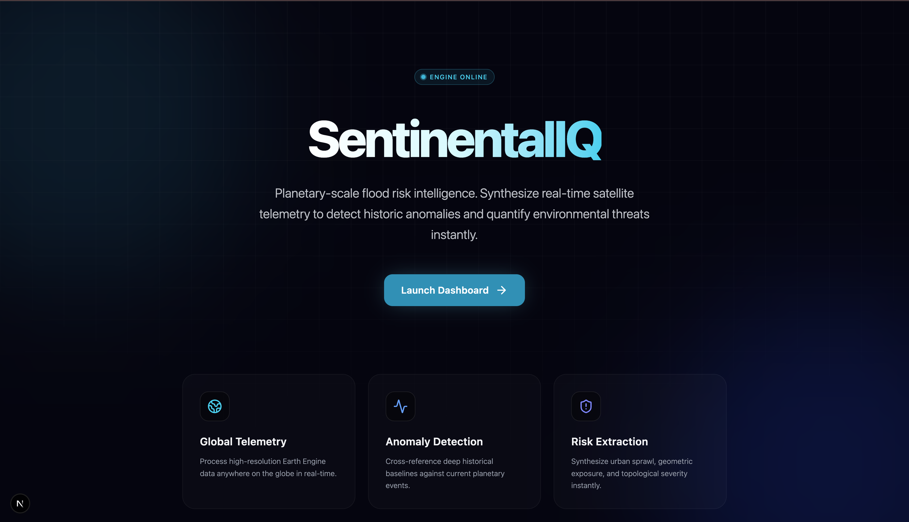
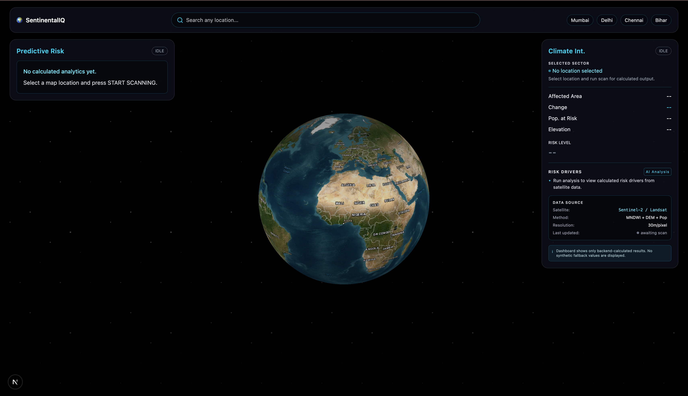
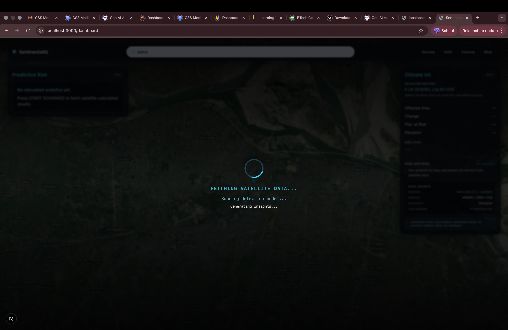

<p align="center">
  
</p>

<h1 align="center">🛰️ SentinelIQ</h1>

<p align="center">
  <b>Planetary-scale flood risk intelligence — powered by satellite telemetry and machine learning.</b>
</p>

<p align="center">
  <a href="#-quick-start"></a>
  <a href="#-screenshots"></a>
  <a href="#-tech-stack"></a>
</p>

<p align="center">
  
  
  
  
  
  
</p>

---

<br/>

## 🌍 About

**Floods are the world's most costly natural disaster.** Every year, they displace millions and cause billions in damage — yet most communities still rely on outdated warning systems.

**SentinelIQ** changes that.

We synthesize **real-time Copernicus Sentinel-2 satellite imagery** with **Google Earth Engine's planetary-scale compute** to detect water body expansion anomalies, quantify flood risk, and deliver actionable intelligence — all through a single click on an interactive globe.

> Built for **disaster response teams**, **urban planners**, **climate researchers**, and anyone who needs to understand flood risk at a glance.

<br/>

---

<br/>

## ✨ Hero

<p align="center">
https://github.com/user-attachments/assets/d55cf23a-e658-4de5-ae54-f9872c9b3776
</p>

<p align="center">
  <i>"Click anywhere on Earth. Get flood risk intelligence in seconds."</i>
</p>

<p align="center">
  SentinelIQ processes <b>6+ years</b> of satellite history per query.<br/>
  Analyzes <b>NDWI water indices</b>, <b>elevation models</b>, <b>population exposure</b>, and <b>urban built-up zones</b>.<br/>
  Delivers a <b>risk classification</b> with full transparency in <b>under 30 seconds</b>.
</p>

<br/>

---

<br/>

## 📸 Screenshots

<table>
  <tr>
    <td width="50%" align="center">
      <br/>
      <b>🏠 Landing Page</b><br/>
      <sub>Cinematic hero with glassmorphism UI</sub>
    </td>
    <td width="50%" align="center">
      <br/>
      <b>🗺️ Interactive Globe Dashboard</b><br/>
      <sub>Click any point — satellite ROI rendered live</sub>
    </td>
  </tr>
  <tr>
    <td width="50%" align="center">
      <br/>
      <b>🛰️ Real-Time Satellite Scanning</b><br/>
      <sub>Live GEE compute with progress feedback</sub>
    </td>
    <td width="50%" align="center">
      <br/>
      <b>⚙️ Engine Architecture</b><br/>
      <sub>Clean modular pipeline with structured logging</sub>
    </td>
  </tr>
</table>

<br/>

---

<br/>

## 🧬 Tech Stack

<table>
  <tr>
    <th align="center">Layer</th>
    <th align="center">Technology</th>
    <th align="center">Purpose</th>
  </tr>
  <tr>
    <td align="center">🛰️ <b>Satellite Data</b></td>
    <td>
      
      
    </td>
    <td>Sentinel-2 SR Harmonized imagery, NDWI computation, cloud masking</td>
  </tr>
  <tr>
    <td align="center">⚙️ <b>Backend</b></td>
    <td>
      
      
      
    </td>
    <td>REST API, risk engine, GEE orchestration, structured logging</td>
  </tr>
  <tr>
    <td align="center">🎨 <b>Frontend</b></td>
    <td>
      
      
      
    </td>
    <td>Glassmorphism UI, responsive layout, animated transitions</td>
  </tr>
  <tr>
    <td align="center">🗺️ <b>Maps</b></td>
    <td>
      
      
    </td>
    <td>3D globe projection, GeoJSON flood overlays, interactive ROI</td>
  </tr>
  <tr>
    <td align="center">📊 <b>Analytics</b></td>
    <td>
      
      
      
    </td>
    <td>Area charts, radar plots, NDWI processing, morphological ops</td>
  </tr>
  <tr>
    <td align="center">🗄️ <b>Storage</b></td>
    <td>
      
      
    </td>
    <td>Analysis history, raster exports, structured JSON logs</td>
  </tr>
  <tr>
    <td align="center">🧪 <b>Testing</b></td>
    <td>
      
    </td>
    <td>Risk threshold validation, monotonicity tests</td>
  </tr>
</table>

<br/>

---

<br/>

## 🚀 Feature Highlights

<table>
  <tr>
    <td>🌐</td>
    <td><b>Global Point-and-Click Analysis</b></td>
    <td>Click anywhere on the 3D globe. SentinelIQ computes flood risk for that exact location using live satellite data — no setup required.</td>
  </tr>
  <tr>
    <td>🛰️</td>
    <td><b>Sentinel-2 Satellite Pipeline</b></td>
    <td>Ingests Copernicus S2 SR Harmonized imagery, applies SCL cloud masking, computes NDWI water indices, and exports analysis-ready GeoTIFFs.</td>
  </tr>
  <tr>
    <td>📈</td>
    <td><b>Historical Anomaly Detection</b></td>
    <td>Compares 5-year dry-season baselines against recent monsoon peaks to detect statistically significant water body expansion.</td>
  </tr>
  <tr>
    <td>🧠</td>
    <td><b>Hybrid Risk Classification</b></td>
    <td>Dual-threshold engine combining absolute flood expansion (km²) with percentage growth — prevents both false positives and missed large-area events.</td>
  </tr>
  <tr>
    <td>🏙️</td>
    <td><b>Urban Exposure Analysis</b></td>
    <td>Cross-references flood zones with elevation models, population density (WorldPop), and built-up area (WSF) to quantify human impact.</td>
  </tr>
  <tr>
    <td>📊</td>
    <td><b>Interactive Analytics Dashboard</b></td>
    <td>Real-time area charts, radar risk drivers, exposure bar charts — all rendered in a dark glassmorphism UI with live status indicators.</td>
  </tr>
  <tr>
    <td>🔍</td>
    <td><b>Geocoded Search</b></td>
    <td>Type any location name — powered by Nominatim geocoding — and the globe flies to the coordinates instantly.</td>
  </tr>
  <tr>
    <td>🗄️</td>
    <td><b>Persistent History</b></td>
    <td>Every analysis is stored in SQLite with full metadata. View past scans, compare regions, and track risk trends over time.</td>
  </tr>
  <tr>
    <td>📝</td>
    <td><b>Structured Logging</b></td>
    <td>Every pipeline stage emits JSON-structured logs with timestamps, request IDs, and metrics — production-grade observability out of the box.</td>
  </tr>
  <tr>
    <td>⚡</td>
    <td><b>FastAPI Backend</b></td>
    <td>Async REST API with CORS, Pydantic validation, auto-generated OpenAPI docs, and hot-reload development support.</td>
  </tr>
</table>

<br/>

---

<br/>

## ⚡ Quick Start

### Prerequisites

- **Python 3.10+** with pip/conda
- **Node.js 18+** with npm
- **Google Earth Engine** account ([sign up](https://earthengine.google.com/signup/))

### 1️⃣ Clone the repository

```bash
git clone https://github.com/ssgamingop/DDoS-PS6.git
cd DDoS-PS6
```

### 2️⃣ Backend setup

```bash
# Create and activate virtual environment
python -m venv .venv
source .venv/bin/activate        # macOS/Linux
# .venv\Scripts\activate         # Windows

# Install dependencies
pip install -r requirements.txt

# Authenticate with Google Earth Engine
earthengine authenticate
```

### 3️⃣ Start the API server

```bash
uvicorn backend.api:app --host 0.0.0.0 --port 8000 --reload
```

### 4️⃣ Frontend setup

```bash
cd frontend
npm install
npm run dev
```

### 5️⃣ Launch

| Service     | URL                        |
|-------------|----------------------------|
| 🌐 Frontend | `http://localhost:3000`    |
| ⚙️ API      | `http://localhost:8000`    |
| 📖 API Docs | `http://localhost:8000/docs` |

### 6️⃣ Run the offline pipeline (optional)

```bash
python -m backend.run_pipeline
```

> Processes satellite imagery through ingestion → preprocessing → detection → risk classification and outputs results to `output/risk_report.json`.

<br/>

---

<br/>

## 📁 Project Structure

```
SentinelIQ/
├── 📋 requirements.txt            # Python dependencies
├── ⚙️ config.yaml                 # Region, satellite, detection parameters
├── 🚀 start.sh                    # One-command launcher (backend + frontend)
│
├── backend/                        # ⚙️ Backend Core
│   ├── api.py                      # FastAPI REST server
│   ├── config.py                   # YAML config loader + rolling date windows
│   ├── run_pipeline.py             # Offline satellite processing pipeline
│   ├── ingestion.py                # GEE satellite image ingestion & export
│   ├── preprocessing.py            # NDWI computation from raw GeoTIFFs
│   ├── detection.py                # NDWI water detection + morphological filtering
│   ├── risk_engine.py              # Hybrid risk classification engine
│   ├── gee_analysis.py             # Live GEE point-analysis with multi-factor scoring
│   ├── database.py                 # SQLite persistence layer
│   └── logging_utils.py            # Structured JSON logging
│
├── frontend/                       # 🎨 Next.js Frontend
│   └── app/
│       ├── page.tsx                # Cinematic landing page
│       ├── layout.tsx              # Root layout + metadata
│       ├── dashboard/
│       │   └── page.tsx            # Main analysis dashboard
│       └── components/
│           ├── MapView.tsx         # MapLibre 3D globe with flood overlays
│           ├── TopBar.tsx          # Search + quick-access risk zones
│           ├── RightPanel.tsx      # Analytics charts + risk indicators
│           ├── LeftPanel.tsx       # Scan controls + location info
│           └── BottomBar.tsx       # History timeline
│
├── ml_training/                    # 🧪 ML Training Notebooks & Data
│
├── data/                           # 📦 Data Artifacts
│   ├── raw/                        # Exported satellite GeoTIFFs
│   └── processed/                  # NDWI maps + flood masks
│
├── output/                         # 📊 Results
│   ├── risk_report.json            # Final risk assessment
│   └── logs.txt                    # Structured pipeline logs
│
├── tests/                          # 🧪 Test Suite
│   └── test_risk_engine.py         # Risk threshold + monotonicity tests
│
└── assets/                         # 🖼️ Media Assets
    └── screenshots/
        ├── banner.png
        ├── dashboard.png
        ├── scanning.png
        └── code snippit.png
```

<br/>

---

<br/>

## 👨‍💻 Meet the Developers

<table>
  <tr>
    <td align="center" width="33%">
      <br/><br/>
      <b>Sasanka</b><br/>
      <sub>🎯 Full-Stack Lead & System Architect</sub><br/><br/>
      <a href="https://www.instagram.com/sashank.codes_?igsh=MWdyNHd2NDFzZWl3Yw=="></a>
      <a href="https://sasankawrites.in/"></a>
    </td>
    <td align="center" width="33%">
      <br/><br/>
      <b>Somyajeet Singh</b><br/>
      <sub>🛰️ Satellite Intelligence & GEE Engineer</sub><br/><br/>
      <a href="http://linkedin.com/in/somyajeetsingh"></a>
      <a href="https://www.instagram.com/somyajeet.op/"></a>
      <a href="https://somyacodes.in/"></a>
    </td>
    <td align="center" width="33%">
      <br/><br/>
      <b>Divyanshu Shahi</b><br/>
      <sub>🎨 Frontend & Data Visualization Engineer</sub><br/><br/>
      <a href="http://linkedin.com/in/divyanshu-shahi"></a>
      <a href="https://www.instagram.com/beingdivyanshupratapshahi/"></a>
    </td>
  </tr>
</table>

<br/>

---

<br/>

## ️ Roadmap

| Phase | Milestone | Status |
|-------|-----------|--------|
| `v1.0` | ✅ Satellite ingestion + NDWI detection pipeline | ✅ Complete |
| `v1.1` | ✅ FastAPI backend + live GEE point-analysis | ✅ Complete |
| `v1.2` | ✅ Next.js dashboard with 3D globe + analytics | ✅ Complete |
| `v1.3` | ✅ Multi-factor risk scoring (elevation, population, urban) | ✅ Complete |
| `v1.4` | ✅ Persistent history + structured logging | ✅ Complete |
| `v2.0` | 🔜 ML-powered flood prediction model (LSTM time-series) | 🚧 In Progress |
| `v2.1` | 🔜 Real-time alert system (email + SMS + webhooks) | 📋 Planned |
| `v2.2` | 🔜 Multi-region batch analysis & scheduling | 📋 Planned |
| `v2.3` | 🔜 Mobile-responsive PWA with offline mode | 📋 Planned |
| `v3.0` | 🔜 Drone imagery integration + high-res local analysis | 📋 Planned |
| `v3.1` | 🔜 Public API marketplace for third-party integrations | 📋 Planned |

<br/>

---

<br/>

<p align="center">
  
</p>

<p align="center">
  <b>SentinelIQ</b> — Because every second counts when water rises.<br/>
  <sub>Made with 🛰️ from Earth, for Earth.</sub>
  
</p>
